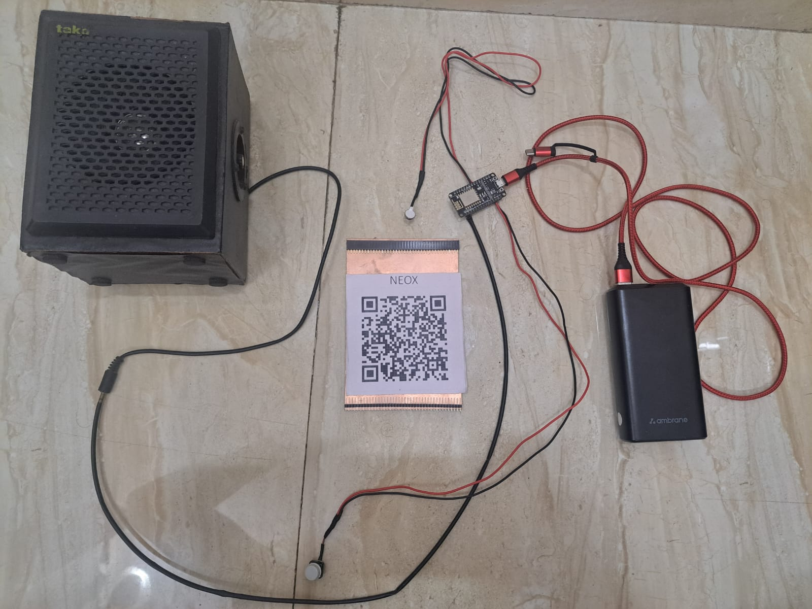

# FingerPay

<div style="display:inline-block;">
  
  
</div>


**FingerPay** is a next-generation wallet application that offers a seamless multi-chain experience across Ethereum and Solana currently. With enhanced security features like fingerprint authentication and an AI-driven payment monitoring system, FingerPay is designed to make blockchain payments more secure, intuitive, and efficient.


## **Table of Contents**

- [Video Demo](#Video-Demo)
- [Vision](#Vision)
- [Features](#Features)
- [Technology Architecture](#Technology-Architecture)
- [Business Model](#Business-Model)
- [Future Scope](#Future-Scope)
- [Technology Stack](#Technology-Stack)
- [Deployment](#Deployment)
- [Contributing](#Contributing)
- [Contact Information](#Contact-Information)

### Video Demo

- **Video Walkthrough**: [FingerPay Demo](https://drive.google.com/drive/folders/1iGlfKLvuEm_uSIM1fvlz-u4qAChesnHg?usp=sharing)


## Vision

Our vision is to revolutionize blockchain payments by making them secure, accessible, and easy to use. FingerPay empowers users to make payments across multiple blockchain networks with the convenience of biometric security and real-time AI payment monitoring. By combining multi-chain support with advanced QR code payments and AI-powered analytics, we are shaping the future of digital transactions.

- **Simplifying Blockchain Payments**: Our vision is to make blockchain payments intuitive and user-friendly, eliminating the complexity that typically comes with decentralized networks. We aim to empower users of all backgrounds, from beginners to experts, to easily engage with multiple blockchains.

- **Unparalleled Security through Biometrics**: By integrating **fingerprint authentication** for wallet creation and transaction approvals, FingerPay ensures that every payment is secure and personalized. Biometric security eliminates the need for traditional passwords or private keys, offering a more reliable and convenient method of protection.

- **Multi-Chain Flexibility**: We provide **seamless interoperability** between major blockchains like Ethereum and  Solana, allowing users to manage their digital assets across multiple networks without any hassle.

- **QR Code Payment Convenience**: FingerPay enables instant payments through **QR codes**, making it fast and easy for users to send and receive funds in both digital and physical environments.

- **Empowering Users with Data**: Our AI-powered analytics equip users with actionable insights, enabling them to better understand their financial activities and make more informed decisions regarding their spending and transactions.

- **Shaping the Future of Digital Transactions**: By combining biometric security, multi-chain support, QR code convenience, and AI-powered analytics, FingerPay aims to lead the evolution of digital payments, making them as simple, secure, and accessible as traditional financial systems.

- **Hardware Integration for Physical Payments**: To bridge the gap between digital and physical payments, we provide **hardware devices** for businesses, enabling them to accept blockchain payments seamlessly in-store. This device announces payment confirmations, making it easier for businesses to integrate blockchain into their existing systems, especially benefiting international customers by eliminating the need for currency exchanges.


## Features

### 1. **Multi-chain Wallet Support**
- Integrates Ethereum andSolana blockchains.
- Seamless wallet creation for each chain, with unified management.
  
### 2. **Biometric Authentication**
- **Fingerprint Authentication**: Secure your wallet creation and payments with fingerprint authentication.
- **Payment Authorization**: Every payment transaction is verified through your fingerprint for enhanced security.

### 3. **QR Code Payments**
- Pay easily and quickly by scanning QR codes.
- Generate QR codes for others to receive payments.
  
### 4. **AI-Powered Payment Monitoring**
- AI system that monitors transaction patterns and provides real-time insights.
- Detects suspicious activities and alerts the user.

### 5. **Cross-Platform Support**
- Available for mobile platforms (Android and iOS).
  
### 6. **Fast Transactions**
- Optimized for low latency and high-speed transactions across blockchains.

### 7. **User-Friendly Interface**
- A clean and intuitive UI that simplifies blockchain payments for everyone.
  
### 8. **Hardware for Retail Payments**
- **Hardware devices** designed for businesses, which announce and confirm blockchain payments, making it easier for retailers to adopt cryptocurrency payments without requiring currency exchanges, especially beneficial for international customers.


## Technical Architecture

## WALLET ARCHITECTURE


## HARDWARE ARCHITECTURE


## Business Model

- **Multi-Chain Wallet Services**: FingerPay operates as a **multi-chain digital wallet** that allows users to transact seamlessly across Ethereum and blockchains. We generate revenue through transaction fees, premium features, and enterprise partnerships with businesses seeking blockchain payment solutions.

- **Hardware Integration**: FingerPay extends its service to physical stores by offering a **dedicated hardware device** (similar to the Paytm box). This device alerts shopkeepers with a voice notification when a payment is received, enhancing the payment experience. It’s designed to work effortlessly with our digital wallet, enabling small and large businesses to adopt blockchain payments without needing additional hardware.

- **Cross-Border Payments**: FingerPay’s hardware solution is especially beneficial for businesses dealing with international customers. Tourists and foreign customers can make payments in cryptocurrency using our device, eliminating the need for **currency exchanges** and associated fees. This makes it easier for businesses to accept global payments without the hassle of managing different fiat currencies.

- **Subscription Model for Businesses**: We offer a **subscription-based service** for businesses that want to utilize advanced features such as transaction analytics, customer insights, and personalized support. Our hardware device will be offered at a subsidized price with the subscription, making it an affordable option for small and medium businesses.

- **AI-Driven Analytics**: Businesses can access AI-driven reports and analytics on their customers’ payment patterns, offering insights that help them optimize their operations. This can be a premium service provided to merchants for a monthly fee, creating an additional revenue stream.

---

## Future Scope

- **Expansion of Hardware Solutions**: Our **hardware device** will evolve to include more features such as voice announcements in multiple languages, real-time payment confirmation, and multi-currency support. This will ensure that **foreign customers** can pay seamlessly via blockchain, regardless of their native currency or location, enhancing cross-border commerce.

- **Global Merchant Network**: We plan to expand our reach by partnering with international retailers and hospitality chains to integrate our blockchain wallet and hardware into their point-of-sale systems, enabling global adoption of blockchain payments. This would empower businesses to cater to international customers without worrying about **currency fluctuations** or **exchange fees**.

- **DeFi Integrations for Businesses**: In the future, FingerPay will integrate decentralized finance (DeFi) features into the hardware and wallet, allowing businesses to leverage blockchain not only for payments but also for **loans**, **yield farming**, and **asset management**, creating a full financial ecosystem.

- **Multi-Blockchain Support Expansion**: We aim to support **more blockchains** in the future, making FingerPay compatible with additional cryptocurrencies and offering broader payment options for both businesses and customers.

- **Retailer Loyalty and Rewards System**: We plan to implement a **loyalty and rewards** system for retailers and customers using FingerPay, incentivizing repeat purchases and brand loyalty through blockchain-based rewards programs.

- **Smart Contracts for Retail**: In the future, smart contracts could be integrated into the FingerPay hardware to automate specific business operations, such as product supply chain management or service-level agreements, offering even more value to businesses adopting our technology.

- **Customizable Hardware for Businesses**: We envision a future where businesses can **customize FingerPay hardware** with their branding and integrate it into their existing store infrastructure, making blockchain payments an integral part of their operations.

This combination of innovative hardware, blockchain integration, and advanced analytics positions FingerPay to shape the future of both digital and physical retail payments.


### Technology Stack

- **Ethereum Integration**: Web3.js for Ethereum blockchain interaction.
- **Solana Integration**: Solana.js for Solana blockchain interaction.
- **APP Wallet**: React-Native
- **AI Module**: Custom AI models integrated into the app for transaction monitoring.
- **Biometric Security**: Integrated fingerprint authentication API (compatible with Android/iOS).
- **QR Code**: QR code generation and scanning libraries for smooth payment transactions.

## Deployment

### Prerequisites

- **React-Native** 
- **Android Studio/Xcode** for mobile deployment.
- **Solana and  Ethereum** for development testing.
- **Fingerprint-enabled device** for biometric testing.

### Steps to Deploy

1. **Clone the Repository**
   ```bash
   git clone https://github.com/YourUsername/FingerPay.git
   ```

2. **Install Dependencies**
   ```bash
   yarn
   ```

3. **Configure Blockchain Connections**
   - Add your Ethereum and  Solananetwork keys in the `.env` file:
     ```bash
      EXPO_PUBLIC_ALCHEMY_ETH_KEY=api-key
      EXPO_PUBLIC_ALCHEMY_ETH_URL=https://eth-sepolia.g.alchemy.com/v2/
      
      EXPO_PUBLIC_ALCHEMY_SOCKET_URL=wss://eth-sepolia.g.alchemy.com/v2/
      
      EXPO_PUBLIC_ALCHEMY_SOL_URL=https://solana-devnet.g.alchemy.com/v2/
      EXPO_PUBLIC_ALCHEMY_SOL_API_KEY=url-key
      EXPO_PUBLIC_ENVIRONMENT=development/mainnet
      
     
     ```

4. **Run on Local Device**
   ```bash
    yarn 
    npx expo start
   ```

6. **Fingerprint Authentication Setup**
   - Ensure that you have a fingerprint-enabled device to test the authentication feature.


## Contributing

Contributions are welcome! Please follow the standard GitHub flow:

1. Fork the repository.
2. Create a new branch (`feature/your-feature`).
3. Commit your changes.
4. Push to the branch.
5. Create a pull request.

## Contact Information

- **Name**: Tanishq
 **Email**: tanishq162005@example.com
 **GitHub**: [Tanishq](https://github.com/tanishq1604)
 
- **Name**: Shivansh Chauhan
 **Email**: shivanshchauhan2005@gmail.com
 **GitHub**: [Shivansh](https://github.com/Programmer-Shivansh)

